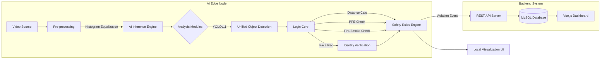

# Mining Hot-Work Safety Monitoring System - Development Plan
> **Project**: 基于AI的矿业动火作业行为安全监测系统  
> **Author**: Wu Qiuyi (22211044)  
> **Date**: 2026-01-29  

## 1. Project Overview
This project aims to develop an intelligent safety monitoring system for mining hot-work operations (e.g., welding, cutting). Utilizing Computer Vision (CV) and Deep Learning technologies, the system monitors critical safety indicators in real-time to prevent accidents caused by human negligence or violations.

> **Constraint**: This project MUST use real interfaces and libraries (e.g., OpenCV, PyTorch, RTSP streams). NO simulation or mock data is allowed for core functions.

### Core Objectives
1.  **Gas Cylinder Safety**: Ensure Oxygen and Acetylene cylinders maintain a safe distance (≥ 5m).
2.  **Fire Hazard Detection**: Detect open flames and sparks to prevent fire outbreaks.
3.  **Personnel Safety**: Verify that all personnel are wearing safety helmets.
4.  **Access Control**: Identify authorized personnel and detect unauthorized intrusion.
5.  **Environmental Adaptability**: Function effectively in low-light and complex mining environments.
6.  **Scalability**: Design for future migration to a full-stack architecture (Frontend-Backend Separation) with database integration.

## 2. Requirements Analysis

### 2.1 Functional Requirements

| Module | Function | Description |
| :--- | :--- | :--- |
| **Cylinder Monitor** | **Detection** | Identify `gas_cylinder`. (YOLO Class Names: `gas_cylinder`) |
| | **Distance Calc** | Calculate real-world distance between cylinders using Monocular Vision. **Trigger when ANY two `gas_cylinder` objects are detected.** |
| | **Alarm** | Trigger alarm if Distance < 5 meters. |
| **Fire Monitor** | **Fire/Spark** | Detect `fire` and `sparks` objects. (YOLO Class Names: `fire`, `sparks`) |
| | **Smoke** | Detect `smoke` objects. (YOLO Class Names: `smoke`) - **WARNING Level** |
| | **Anti-Interference**| Use multi-frame consistency to filter noise. |
| **PPE Monitor** | **Helmet Check** | Detect `helmet` and `no-helmet`. (YOLO Class Names: `helmet`, `no-helmet`) |
| | **Violation** | **Directly trigger alarm** if `no-helmet` is detected. |
| **Access Control** | **Face Recognition** | **Identify specific personnel** (e.g., "Worker A", "Stranger"). |
| | **Liveness Check** | **Anti-Spoofing**: Ensure the detected face is real (not a photo/video). |
| | **Intrusion Logic** | Trigger alarm if **unauthorized person** is detected in restricted areas. |
| **System Core** | **Video Input** | Support **RTSP/RTMP streams**, **Local Camera**, **Local Video Files**, and **Local Image Files**. |
| | **Enhancement** | Apply **Histogram Equalization** (HE/CLAHE) as a pre-processing step. |
| | **UI/Dashboard** | Display video, bounding boxes, status info, and alarm logs. |
| **Data Management** | **Database** | Store Personnel Info, Device Status, and Alarm Logs. |
| | **API** | Provide RESTful APIs for frontend interaction (Future). |

### 2.2 Non-Functional Requirements
- **Real-Time Performance**: The system must process video frames with low latency (aim for > 15 FPS on target hardware).
- **Robustness**: Handle low-light, dust, and occlusion typical in mining environments.
- **Modularity**: Components (Detection, Logic, UI) should be loosely coupled for easy maintenance.

## 3. System Architecture

> **Architecture Documentation**（同目录）:
> - [AI Edge System Architecture](AI_ARCHITECTURE.md)
> - [Backend System Architecture](BACKEND_ARCHITECTURE.md)
> - [Frontend Dashboard Architecture](FRONTEND_ARCHITECTURE.md)

### 3.1 Technology Stack
- **Programming Language**: Python 3.8+
- **Deep Learning Framework**: PyTorch
- **Object Detection**: YOLOv11 (Ultralytics)
- **Face Recognition**: **DeepFace** (wrapping ArcFace/VGG-Face for identity verification)
- **Computer Vision**: OpenCV (cv2)
- **GUI Framework**: PyQt5 or PySide6 (for Desktop Prototype)
- **Backend API**: FastAPI
- **Database**: MySQL (SQLAlchemy ORM)
- **Frontend Framework**: Vue.js
- **Data Handling**: NumPy, Pandas

### 3.2 System Pipeline


## 4. Development Roadmap (Updated: 2026-04-23)

### Phase 1: Preparation & Data (Completed)
- [x] Literature Review & Proposal.
- [x] Requirement Analysis.
- [x] **Data Collection**: Gather datasets for Cylinders, Fire, Helmets, Faces.
- [x] **Data Preprocessing**: Annotation, Augmentation, Low-light simulation.

### Phase 2: Core Detection Models (Completed, With Ongoing Optimization)
- [x] **Dataset Preparation**:
    -   **Structure**: Organize data into YOLOv11 standard format (images/labels split into train/val/test).
    -   **Split Ratio**: Recommended 70% Train, 20% Validation, 10% Test.
    -   **Config**: Create `data.yaml` defining paths and class names.
- [x] **YOLOv11 Environment Setup**: Install dependencies (`ultralytics`, `torch`).
- [x] **Model Training (Unified Model)**:
    -   **Data Collection**: Gather and label images for ALL classes: `gas_cylinder`, `fire`, `sparks`, `smoke`, `face`, `helmet`, `no-helmet`.
    -   **Training Strategy**: Train a SINGLE YOLOv11 detection model to recognize all 8 classes simultaneously.
    -   **Validation**: Ensure balanced performance across small objects (sparks) and large objects (people).
- [x] **Evaluation**: Validate detection and distance-related metrics on benchmark/test outputs (`model_benchmark_outputs/`).

### Phase 3: Advanced Logic Implementation (Completed)
- [x] **Monocular Distance Estimation**:
    -   Implement Camera Calibration (get Intrinsic Matrix).
    -   Develop Pinhole Model logic to estimate depth/distance based on object pixel height/width.
    -   Implement coordinate transformation (Image Plane -> World Plane).
- [x] **Access Control Logic**:
    -   **Face Recognition**: Integrate **DeepFace** library to extract features from YOLO-detected `face` crops.
    -   **Database**: Maintain a local/remote registry of authorized personnel features.
    -   **Liveness**: Implement basic blink detection or multi-frame variance check.
    -   **Logic**: Allow if "Authorized", Alarm if "Unknown" or "Blacklisted".

### Phase 4: Edge App Integration (Completed)
- [x] **Desktop UI Development**: Create a PyQt main window for local monitoring.
    -   Video Display Widget (Support RTSP/Camera/File).
    -   Alarm/Log Panel.
- [x] **Edge Integration**: Connect Video Stream -> Preprocessor -> Model -> Logic -> UI.
- [x] **Alarm Logic**: Implement sound/visual alerts for violations.

### Phase 5: Backend & Database Development (Completed)
- [x] **Backend Setup**: Initialize FastAPI project.
- [x] **Database Design**: Create MySQL schemas for `Users`, `Devices`, `Alerts`.
- [x] **API Development**: Implement REST APIs for event reporting and data retrieval.
- [x] **Edge-Cloud Sync**: Connect AI Edge Node to Backend via REST API.

### Phase 6: Web Management Dashboard (Completed)
- [x] **Frontend Setup**: Initialize Vue.js project (Vue 3 + Vite + TypeScript).
- [x] **Dashboard Features**:
    -   Real-time Alert Monitoring (with metadata display).
    -   Historical Data Analysis.
    -   Device Management.
    -   Task Management (create, assign, track tasks).
    -   User Management (admin only).
- [x] **Integration**: Connect Vue Frontend to FastAPI Backend.

### Phase 7: Optimization & Final Testing (In Progress)
- [~] **System Testing**: API and integration-related automated tests are available and passing (backend + frontend reports), while full long-running field E2E scenarios remain to be continuously expanded.
- [~] **Performance Tuning**: Model benchmark and distance-evaluation outputs are present and updated; online FPS/latency and edge deployment tuning are still iterative tasks.

### Current Progress Snapshot (As of 2026-04-23)
- **Overall Project**: ~93%
- **AI Edge**: ~90%
  - Core detection, safety logic, UI integration completed.
  - Remaining focus is robustness/performance tuning in real deployment environments.
- **Backend**: ~95%
  - Core modules and API endpoints completed, with test reports showing all current cases passed.
  - Remaining work is production hardening and full workflow pressure scenarios.
- **Frontend**: ~95%
  - Dashboard modules and API integration completed, with API-layer tests passing.
  - Remaining work is end-user validation polish and field workflow refinement.

## 5. Implementation Details (for Agent)

### 5.1 Directory Structure
```
Mining_Hot-Work_Safety_Monitoring_System/
├── ai_edge_system/                # [AI Block] Edge Node & Intelligent Analysis
│   ├── data/
│   │   ├── face_db/               # Registered user images
│   │   ├── train/                 # train dataset
│   │   ├── val/                   # val dataset
│   │   ├── test/                  # test dataset
│   │   └── data.yaml              # YOLO config
│   ├── models/                    # Trained .pt files & DeepFace weights
│   ├── src/
│   │   ├── core/
│   │   │   ├── detector.py        # YOLOv11 Wrapper
│   │   │   ├── recognizer.py      # Face Recognition (DeepFace)
│   │   │   └── uploader.py        # Async REST Client (Alerts/Heartbeat)
│   │   ├── logic/
│   │   │   ├── distance.py        # Distance estimation
│   │   │   └── safety.py          # Rule engine
│   │   ├── ui/
│   │   │   └── main_window.py     # PyQt Local Interface
│   │   ├── enhancer.py            # Histogram Equalization (CLAHE)
│   │   └── utils/
│   │       ├── calibration_tool.py # Camera Calibration UI
│   │       ├── camera.py          # Intrinsics Management
│   │       └── label_remapper.py  # Label remapping tool
│   ├── main.py                    # Entry Point
│   └── train.py                   # Adaptive Training Script
├── backend_system/                # [Backend Block] Data Center & API
│   ├── app/
│   │   ├── models/                # SQLAlchemy Models (Users, Devices, Alerts, Tasks)
│   │   ├── schemas/               # Pydantic Schemas
│   │   ├── api/                   # API Endpoints (Auth, Users, Devices, Alerts, Tasks)
│   │   ├── services/              # Business Logic Services
│   │   └── core/                  # Config & Security
│   ├── scripts/
│   │   ├── init_db.py             # Database initialization
│   │   └── calibration_tool.py   # Camera calibration tool (command-line)
│   ├── static/
│   │   ├── evidence/              # Stored Alert Images
│   │   └── calibration_temp/     # Temporary calibration files
│   ├── tests/                     # Test suite
│   ├── alembic/                   # DB Migrations
│   ├── main.py                    # FastAPI Entry Point
│   └── requirements.txt
├── frontend_dashboard/            # [Frontend Block] Web Management
│   ├── src/                       # Vue.js Components & Views
│   │   ├── api/                   # Axios wrappers
│   │   ├── components/            # Reusable UI components
│   │   ├── views/                 # Pages (Login, Dashboard, Devices)
│   │   └── store/                 # Pinia State Management
│   ├── public/
│   └── package.json
└── README.md
```

### 5.2 Key Algorithms
- **Distance Estimation (Monocular Vision)**:
  $ D = \frac{F \times H_{real}}{H_{pixel}} $
  Where $F$ is focal length (**calibrated focal length in pixel units**), $H_{real}$ is real object height (e.g., Cylinder ~1.4m), $H_{pixel}$ is object height in pixels.
- **PPE Compliance**:
  Directly detect `helmet` and `no-helmet` classes. Trigger alarm if `no-helmet` is detected.

## 6. Next Immediate Tasks (Updated)
1.  **End-to-End Scenario Validation**: Run and document complete flows across Edge -> Backend -> Frontend under real camera/RTSP conditions.
2.  **Performance Baseline Consolidation**: Fix target metrics (FPS, alert latency, stream startup time) and generate comparable benchmark baselines.
3.  **Deployment Hardening**: Finalize production configs (logging, retention, error handling, service restart strategies).

### 7.1 System Topology & Data Flow
-   **Architecture Type**: Hybrid Edge-Cloud (IoT).
-   **Communication**:
    -   **Edge -> Cloud**: Asynchronous HTTP POST for Alerts & Heartbeats. "Fire-and-forget" with local buffering (Threaded Uploader).
    -   **Frontend -> Cloud**: Synchronous HTTP Request/Response (Polling for updates).
-   **Critical Path**: `Camera -> YOLO -> SafetyEngine -> AlertUploader -> API -> DB -> Frontend`.
    -   **Bottleneck Risk**: High-resolution video processing on Edge (FPS drop) and Network latency for Alert Upload.

### 7.2 Frontend Architecture (New)
Detailed in [FRONTEND_ARCHITECTURE.md](FRONTEND_ARCHITECTURE.md).
-   **Framework**: Vue 3 + Vite + TypeScript.
-   **State**: Pinia (Centralized Store).
-   **UI**: Element Plus + Tailwind CSS.
-   **Key Pattern**: Service-Repository pattern for API calls; Polling mechanism for real-time updates (Phase 6 target).

### 7.3 Interface Contracts
-   **Edge Internal**: Defined in [AI_EDGE_INTERFACE.md](AI_EDGE_INTERFACE.md). Python dictionary based.
-   **API (Edge-Backend)**: Defined in [BACKEND_INTERFACE.md](BACKEND_INTERFACE.md). RESTful, JSON + Multipart (Images). Authentication via `X-Device-Token`.
-   **API (Frontend-Backend)**: Defined in [FRONTEND_INTERFACE.md](FRONTEND_INTERFACE.md). RESTful, JSON. Authentication via JWT (`Authorization: Bearer`).
